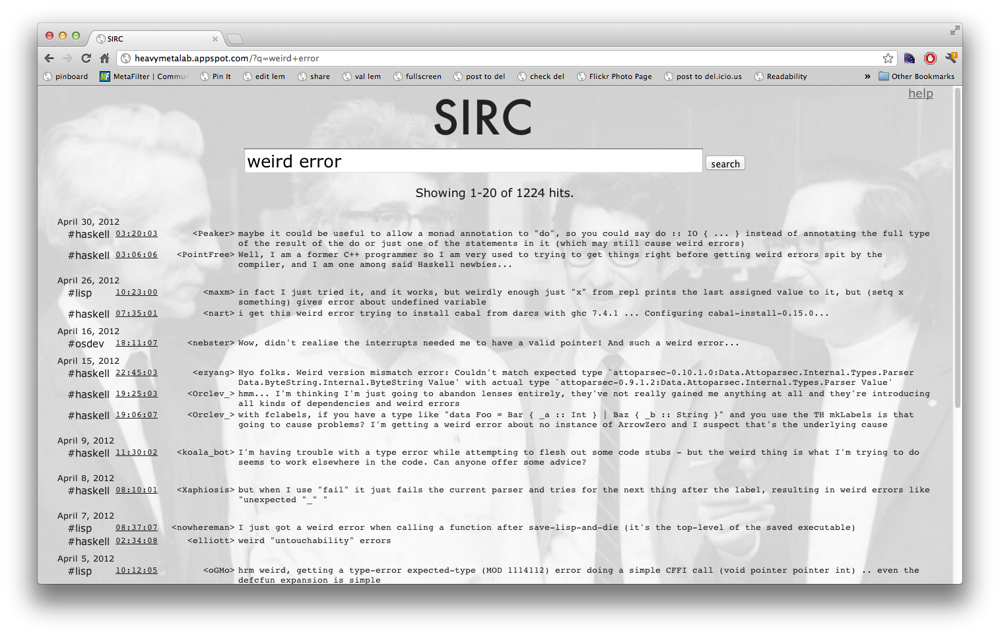

SIRC - "Search IRC"
===================

SIRC is a search engine for IRC logs.  It has four big parts:

* The front end, which lets users do searches and shows the results (and lets users browse old logs).
* The back end, which indexes IRC logs and stores them in the log repository.
* The search index.
* The log repository.

The front end
-------------

The front end is written in Python and runs on Google's App Engine.
You can see it in action at
[http://heavymetalab.appspot.com/](http://heavymetalab.appspot.com/):

